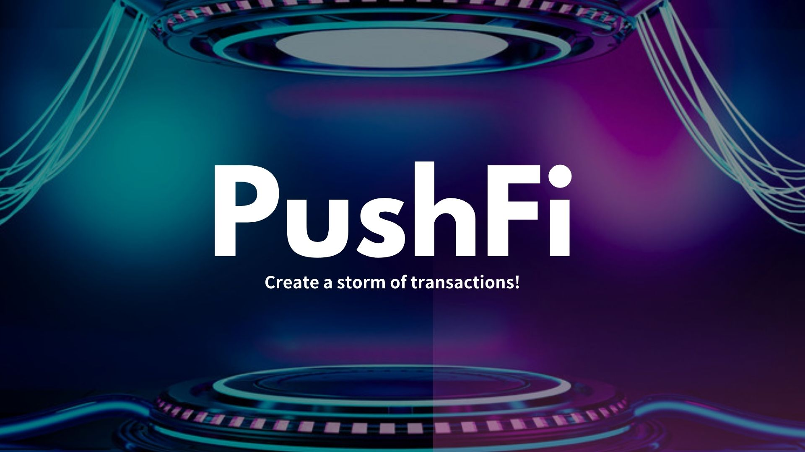
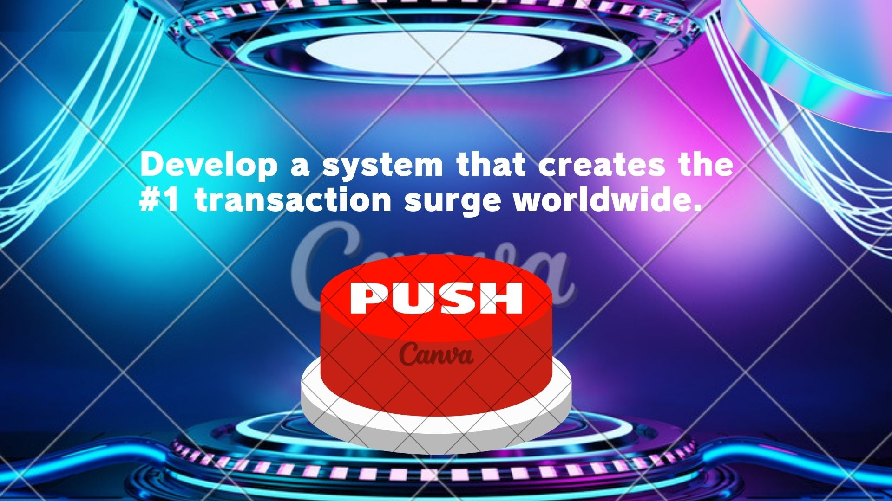
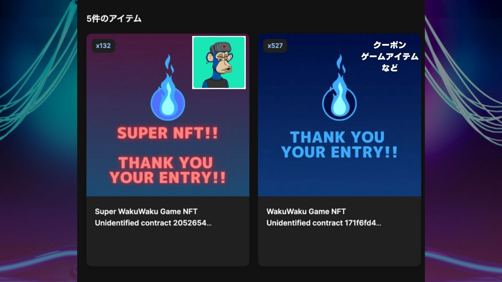
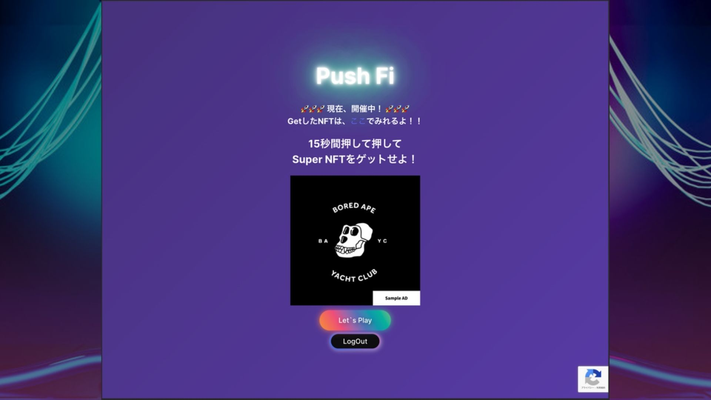
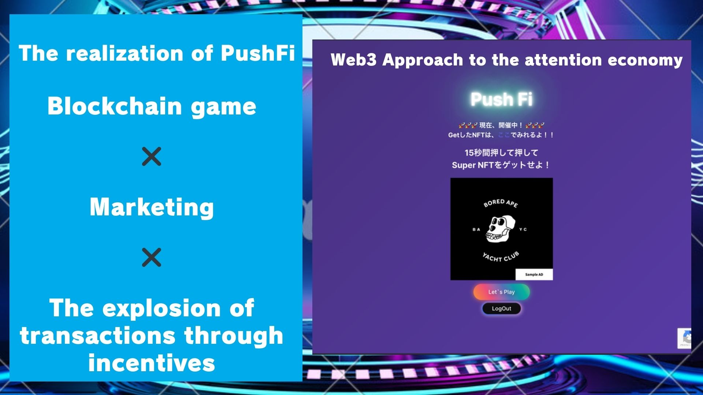
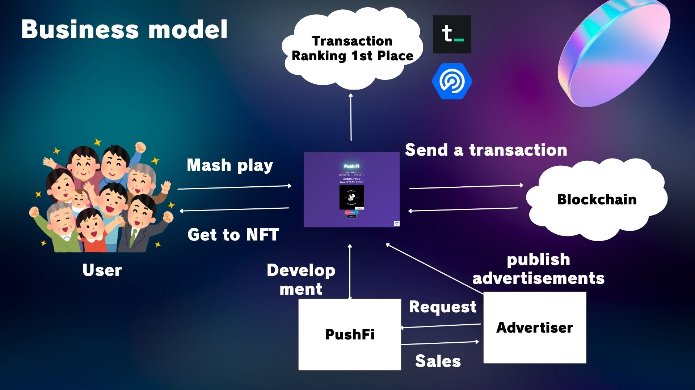
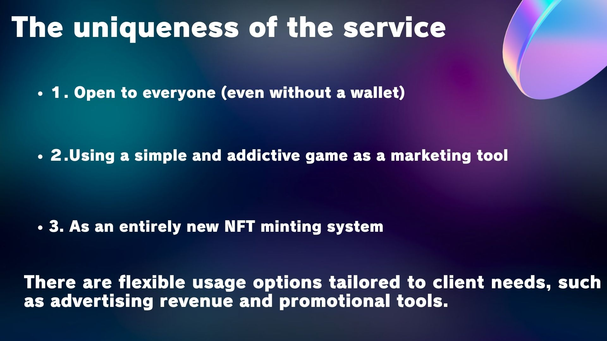
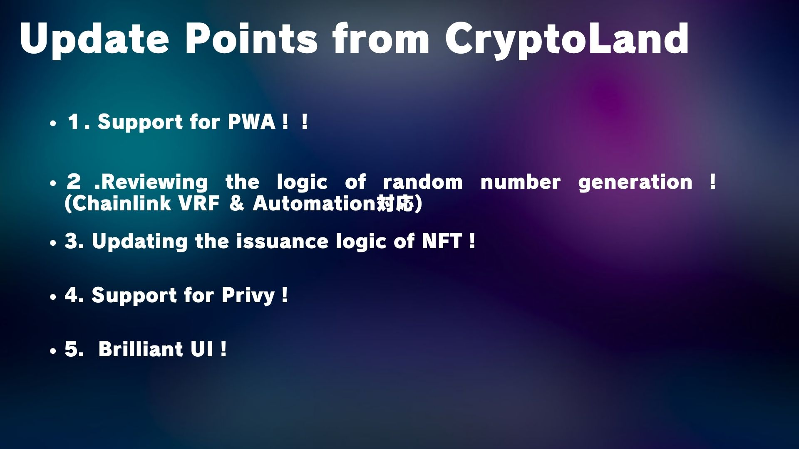

# Push Fi

<strong>トランザクションの嵐を巻き起こせ!!</strong>

## Live demo on Netlify

[](https://app.netlify.com/sites/pushfi/deploys)

[https://pushfi.netlify.app/](https://pushfi.netlify.app/)

## サイトへの QR コード

<div align="center">
  <a
    href="https://pushfi.netlify.app/"
    target="blank"
  >
     
  </a>
  
</div>

## What it does

Push Fi は世界一のトランザクションを巻き起こすアプリケーションです。

ユーザーは使い始めるのにパスワードの設定などは不要です。  
Privy と BiconomySDK によりユーザーフレンドリーな UX を実現させています。

ユーザーがやることはボタンを押すだけ！！

ゲームが始まると 15 秒間の時間が設けられるので、その間ひたすらボタンを連打します。この時連打した回数だけスーパー NFT をミントできるチャンスが増えます！！

一気に 100 人でゲームを実施したらそれだけで 1 万近くのトランザクションを発火できる可能性があります！！

トランザクションを発火させる間にできる待ち時間にはユーザーに広告を見てもらうことでスキマ時間もうまく活用できるようになっています！

## The Value of this product

Privy ✖️ AA ✖️ シンプルな UI により、超手軽に遊べるブロックチェーンゲームとなっています！！

また、連打するという今までブロックチェーンシステムにあまり取り入れられてこなかったような要素も取り入れてユーザーが楽しめるようにしました。

ゲームをプレイするまでのステップも簡単なのでこれまでブロックチェーンに馴染みが無かった人も巻き込んでトランザクションの嵐を巻き起こすことができます！！

Web3 をもっと面白く盛り上げていく可能性がこの PushFi の最大の魅力になります！！  
EVM のブロックチェーンかつ Biconomy 対応のブロックチェーンであればいずれのブロックチェーンでも動かすことができます！！

## Technologies I used

Next.js  
hardhat  
TypeScript  
Account Abstraction  
openzeppelin  
yarn workspaces  
Privy  
BiconomySDK  
Web3Storage  
TheGraph

## How we built it

ryuta

調査・プレゼン・資料を担当

mashharuki

調査・開発を担当

## What we learned

Privy と BiconomySDK を組み合わせた AA アプリケーションの開発手法を学びました。  
また、バッチトランザクションを応用してユーザーに連打させただけトランザクションを発火させるという方法を思いつき実装することができました。

また、ゲームと広告という AA と比較的相性が良いとされる 3 つのカテゴリを組み合わせたプロダクトを形にする方法を学びました。

## What's next for

UX の改善、スーパー NFT の具体的なユースケースの模索

現時点で考えているアイディア  
スーパー NFT を 10 枚集めるとクーポンやポップコーンに交換できるといった現実世界のものとのトレードへの活用

スーパー NFT を NFT プロジェクトプレミント用の AL NFT にして他の Web3 プロジェクトとコラボするなど

以下、WaveHack でやろうとしていること。

- TheGraph など新しいプロトコルの導入。
- MantaNetwork など別のチェーンへの対応の検討

## 動かし方

- インストール

  ```bash
  yarn
  ```

- フロントの起動

  ```bash
  yarn frontend dev
  ```

- メタデータ類のアップロード

  ```bash
  yarn upload
  ```

- セットアップ

  ```bash
  yarn backend task:createGame --network baseSepolia
  ```

- スマートコントラクトのコンパイル

  ```bash
  yarn backend compile
  ```

- スマートコントラクトのデプロイ

  ```bash
  backend deploy:fuji
  ```

- スマートコントラクトの検証

  ```bash
  yarn backend verify:fuji
  ```

- モック用の VRF コントラクトを使って乱数を生成する

  ```bash
  yarn backend scripts:mock:getRandamNumber:fuji
  ```

  実行例

  ```bash
  ======================= start =========================
  randamNumber: 10602206972064053867483789272536493107592815164562923766237165007315967766038
  ======================== end  ========================
  ✨  Done in 1.43s.
  ✨  Done in 1.57s.
  ```

- スマートコントラクトのテスト

  ```bash
  yarn backend test
  ```

  実行例

  ```bash
    Compiled 1 Solidity file successfully (evm target: paris).

    WakuWakuGame
      init
        ✔ initial owner
        ✔ initial balance
      Game
        ✔ create new game test
        ✔ play game test
        ✔ 【error】play game test
      Withdraw ERC20 Token
        ✔ Withdraw ERC20 Token test

    ERC404 Examples
      init
        ✔ initial info
        ✔ check initial whitelist
      function test
        ✔ trasfer test
        ✔ trasfer test2
        ✔ trasfer & mint NFT test
        ✔ trasfer & mint NFT (otherAccount → otherAccount2) test

    WakuWakuGameV2
      init
        ✔ initial owner
      Game
        ✔ create new game test
        ✔ play game test 【 10 times】
        ✔ play game test 【 20 times】

    WakuWakuGameV5 test
      init
        ✔ initial owner
      createNewGame
        ✔ create new game
      change game status
        ✔ change game status
        ✔ change enemyUrl
        ✔ change normal NFT
        ✔ change super NFT
      playGame
        ✔ 【Seazon1】play game
        ✔ play game by multi players
        ✔ 【Seazon1】emit event test
        ✔ 【Seazon2】play game - simple attack(win)
        ✔ 【Seazon2】play game - simple attack(win) - emit event
        ✔ 【Seazon2】play game - simple attack(lose)
        ✔ 【Seazon2】play game - simple attack(lose) - emit event
        ✔ 【Seazon2】play game - GameFinish
        ✔ 【Seazon2】play game - GameFinish - emit Event

  ·------------------------------------------|---------------------------|-------------|-----------------------------·
  |           Solc version: 0.8.20           ·  Optimizer enabled: true  ·  Runs: 200  ·  Block limit: 30000000 gas  │
  ···········································|···························|·············|······························
  |  Methods                                 ·               20 gwei/gas               ·      493644.15 jpy/eth      │
  ·····················|·····················|·············|·············|·············|···············|··············
  |  Contract          ·  Method             ·  Min        ·  Max        ·  Avg        ·  # calls      ·  jpy (avg)  │
  ·····················|·····················|·············|·············|·············|···············|··············
  |  BattleCardNFT     ·  safeTransferFrom   ·      54209  ·      59009  ·      56609  ·            8  ·     558.89  │
  ·····················|·····················|·············|·············|·············|···············|··············
  |  BattleCardNFT     ·  transferOwnership  ·          -  ·          -  ·      28656  ·            1  ·     282.92  │
  ·····················|·····················|·············|·············|·············|···············|··············
  |  Example           ·  transfer           ·      56716  ·     150236  ·     110140  ·            5  ·    1087.40  │
  ·····················|·····················|·············|·············|·············|···············|··············
  |  USDCToken         ·  faucet             ·          -  ·          -  ·      51295  ·            1  ·     506.43  │
  ·····················|·····················|·············|·············|·············|···············|··············
  |  WakuWakuGame      ·  createGame         ·          -  ·          -  ·     169644  ·            4  ·    1674.88  │
  ·····················|·····················|·············|·············|·············|···············|··············
  |  WakuWakuGame      ·  playGame           ·      45828  ·     223694  ·      72751  ·           30  ·     718.26  │
  ·····················|·····················|·············|·············|·············|···············|··············
  |  WakuWakuGame      ·  withdrawToken      ·          -  ·          -  ·      60157  ·            1  ·     593.92  │
  ·····················|·····················|·············|·············|·············|···············|··············
  |  WakuWakuGameV2    ·  createGame         ·          -  ·          -  ·     262795  ·            3  ·    2594.54  │
  ·····················|·····················|·············|·············|·············|···············|··············
  |  WakuWakuGameV2    ·  playGame           ·      85873  ·     194831  ·     102498  ·           30  ·    1011.95  │
  ·····················|·····················|·············|·············|·············|···············|··············
  |  WakuWakuGameV5    ·  changeEnemyUrl     ·          -  ·          -  ·      43863  ·            1  ·     433.05  │
  ·····················|·····················|·············|·············|·············|···············|··············
  |  WakuWakuGameV5    ·  changeNormalNft    ·          -  ·          -  ·      30429  ·            1  ·     300.42  │
  ·····················|·····················|·············|·············|·············|···············|··············
  |  WakuWakuGameV5    ·  changeSuperNft     ·          -  ·          -  ·      30449  ·            1  ·     300.62  │
  ·····················|·····················|·············|·············|·············|···············|··············
  |  WakuWakuGameV5    ·  createGame         ·          -  ·          -  ·     309381  ·           14  ·    3054.48  │
  ·····················|·····················|·············|·············|·············|···············|··············
  |  WakuWakuGameV5    ·  pauseGame          ·          -  ·          -  ·      28735  ·            1  ·     283.70  │
  ·····················|·····················|·············|·············|·············|···············|··············
  |  WakuWakuGameV5    ·  playGame           ·      63284  ·     219726  ·     154349  ·           25  ·    1523.87  │
  ·····················|·····················|·············|·············|·············|···············|··············
  |  WakuWakuNFT       ·  transferOwnership  ·          -  ·          -  ·      28656  ·            4  ·     282.92  │
  ·····················|·····················|·············|·············|·············|···············|··············
  |  WakuWakuSuperNFT  ·  transferOwnership  ·          -  ·          -  ·      28656  ·            1  ·     282.92  │
  ·····················|·····················|·············|·············|·············|···············|··············
  |  Deployments                             ·                                         ·  % of limit   ·             │
  ···········································|·············|·············|·············|···············|··············
  |  BattleCardNFT                           ·          -  ·          -  ·    1598646  ·        5.3 %  ·   15783.24  │
  ···········································|·············|·············|·············|···············|··············
  |  Example                                 ·          -  ·          -  ·    1397184  ·        4.7 %  ·   13794.23  │
  ···········································|·············|·············|·············|···············|··············
  |  USDCToken                               ·          -  ·          -  ·     574326  ·        1.9 %  ·    5670.25  │
  ···········································|·············|·············|·············|···············|··············
  |  WakuWakuGame                            ·          -  ·          -  ·    1391513  ·        4.6 %  ·   13738.25  │
  ···········································|·············|·············|·············|···············|··············
  |  WakuWakuGameV2                          ·          -  ·          -  ·    1267612  ·        4.2 %  ·   12514.98  │
  ···········································|·············|·············|·············|···············|··············
  |  WakuWakuGameV5                          ·          -  ·          -  ·    2394453  ·          8 %  ·   23640.15  │
  ···········································|·············|·············|·············|···············|··············
  |  WakuWakuNFT                             ·          -  ·          -  ·    1598797  ·        5.3 %  ·   15784.74  │
  ···········································|·············|·············|·············|···············|··············
  |  WakuWakuSuperNFT                        ·          -  ·          -  ·    1598534  ·        5.3 %  ·   15782.14  │
  ·------------------------------------------|-------------|-------------|-------------|---------------|-------------·

    31 passing (2s)

  ✨  Done in 8.27s.
  ```

- フォーマットの有効化

  `frontend`と`backend`配下にそれぞれ移動して実行

  ```bash
  npx prettier --write .
  ```

- サブグラフのデプロイ

  ```bash
  yarn subgraph codegen
  ```

  ```bash
  yarn subgraph build
  ```

  ```bash
  yarn subgraph deploy
  ```

  デプロイしたサブグラフ(Base Sepolia)

  [https://api.studio.thegraph.com/query/44992/pushfi3/v0.0.1](https://api.studio.thegraph.com/query/44992/pushfi3/v0.0.1)

  デプロイしたサブグラフ(zkSync Sepolia)

  [https://api.studio.thegraph.com/query/44992/pushfi-zksync/v0.0.1](https://api.studio.thegraph.com/query/44992/pushfi-zksync/v0.0.1)

  ゲームデータを取得するサンプルクエリ

  ```gql
  query MyQuery {
    gameCreateds(orderBy: gameId, orderDirection: desc, first: 1) {
      gameId
      gameName
      gameSeacon
      normalNftAddress
      openingStatus
      transactionHash
      superNftAddress
      winner
      enemyInfo_enemyLife
      enemyInfo_enemyImgUrl
      currentSupply
      cardNftSupply
      cardNftAddress
    }
  }
  ```

  Attack の履歴を取得するクエリ

  ```gql
  query MyQuery {
    attacks(orderBy: gameId, orderDirection: desc, where: { gameId: "0" }) {
      gameId
      player
      pushCount
      attack
      result
    }
  }
  ```

  NFT の発行履歴を取得するクエリ

  ```gql
  query MyQuery {
    nftMinteds(orderDirection: desc, orderBy: gameId) {
      gameId
      player
      nftAddress
    }
  }
  ```

  ゲームが終了した履歴を取得するクエリ

  ```gql
  query MyQuery {
    gameFinisheds(orderBy: gameId, orderDirection: desc, first: 1) {
      gameId
      winner
    }
  }
  ```

  BattleCardNFT の発行数を取得するクエリ

  ```gql
  query MyQuery {
    currentSupplyUpdateds(
      orderBy: blockTimestamp
      orderDirection: desc
      first: 1
    ) {
      gameId
      newSupply
      cardNftAddress
    }
  }
  ```

  大ボスの体力を取得するクエリ

  ```gql
  query MyQuery {
    enemyLifeUpdateds(first: 1, orderBy: blockTimestamp, orderDirection: desc) {
      gameId
      newEnemyLife
    }
  }
  ```

## メタデータ関連

1. NFT 用のメタデータ(サンプル)

- [gif](https://bafybeigmzj3hktgmjpbsl6akvlmucgrwedvajhp4ehjhtvuwdoexjy2hci.ipfs.dweb.link/img/nftImg.gif)
- [json](https://bafybeihd5jasbp6spqqapd6jzy7zfosiukwqbx4capmhayjt3yxagudwma.ipfs.dweb.link/json/metadata)

2. Super NFT 用のメタデータ

- [git](https://bafkreigk4b5bdrl6i7aleiolfhngc3b5cgl3altssjzqt3qoc2b26ibzcm.ipfs.w3s.link/)
- [json](https://bafkreib4c2d7kp4xspm42cxw32m4ilvbzuj4prbimwejkvjammpqo2mqym.ipfs.w3s.link/)

3. 広告用の画像データ

- [sampleGif.gif](https://bafybeigmzj3hktgmjpbsl6akvlmucgrwedvajhp4ehjhtvuwdoexjy2hci.ipfs.dweb.link/gif/sampleGif.gif)
- [sampleImg2](https://bafkreihnwh275aqcc6sjo2f37yaphhh2rp44tsmdrsv25k72iiozybzluy.ipfs.w3s.link/)
- [sampleBAYC](https://bafkreie4o7bbfitr4vmuckphvmf7n3aettzb57necosjf3oo5e5syhcfgq.ipfs.w3s.link/)

## ピッチスライド













### 参考文献

1. [Chainlink Verifiable Randomness Function](https://vrf.chain.link/)
2. [Chainlink Verifiable Randomness Function - Avalanche Fuji testnet](https://docs.chain.link/vrf/v2/subscription/supported-networks#avalanche-fuji-testnet)
3. [Remix - VRFv2DirectFundingConsumer.sol](https://remix.ethereum.org/#url=https://docs.chain.link/samples/VRF/VRFv2DirectFundingConsumer.sol&lang=en&optimize=false&runs=200&evmVersion=null&version=soljson-v0.8.24+commit.e11b9ed9.js)
4. [Sample Randamness Contract](https://vrf.chain.link/fuji/1434)
5. [Sample Randamness Contract - Snowtrace](https://testnet.snowtrace.io/address/0x2A2f5591FaF06EAC30Cf46A78D16Cce2d97B4dD7)
6. [Privy & Biconomy](https://docs.privy.io/guide/frontend/account-abstraction/biconomy)
7. [Next.js 環境での PWA(Progressive Web App)の導入手順](https://zenn.dev/tns_00/articles/next-pwa-install)
8. [Filecoin - faucet](https://faucet.calibnet.chainsafe-fil.io/funds.html)
9. [OKLINK - verify-proxy-contract](https://www.oklink.com/docs/en/#rpc-api-contract-verify-proxy-contract)
10. [GitHub - hardhat-oklink-verify](https://github.com/enjinstarter/hardhat-oklink-verify)
11. [OKLink Docs - verify-with-hardhat](https://www.okx.com/xlayer/docs/developer/smart-contract/verify-with-hardhat)
12. [Manta Network - Hardhat](https://docs.manta.network/docs/zkShuffle/Deploy/Hardhat)
13. [Graph Studio](https://thegraph.com/studio/)
14. [How to Use the Subgraph Studio](https://thegraph.com/docs/en/deploying/subgraph-studio/)
15. [MantaSepolia BlockExplorer](https://pacific-explorer.sepolia-testnet.manta.network/)
16. [Blockscout API Docs](https://docs.blockscout.com/for-users/api/rpc-endpoints)
17. [Akindo's WaveHack Page](https://app.akindo.io/communities/VwLa2ozZNcxdR9l6/products/DrKMKJ8WPCZ6pBVgq)
